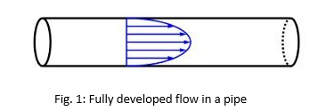
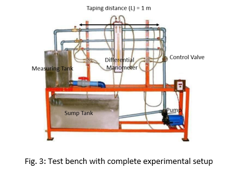

<b>Introduction</b> 
<image src="images/"> 
Generally, in all hydraulic systems it is observed that there are some energy losses with respect to friction and geometrical changes. The frictional loss in pipes is mainly because of the viscosity of fluid near the inner wall surface of the pipe. There are other energy losses also which are attributed to the pressure changes in a hydraulic system because of the pipe fittings like bends, obstructions, expansion and contraction. All the energy loss happening in a pipe flow changes to heat energy. In other words, the more the energy losses more energy is required to pump the liquid or gas through the pipes. 
<b>Components of Experimental setup</b> 
<image src="images/"> 
Fig. 3 shows a schematic of test rig or bench for determination of frictional losses in a pipe, who’s each part is explained as follow:  
                    					
<b>1. Flow Meter</b> 
The test bench consists of flow meter for the experiments. The meter shows the amount of water flowing through the pipe 
<b>2. Control Valve </b> 
A Control valve is provided through which the flow rate of the water flowing through the pipes is controlled. Through this valve, one can make flow laminar or turbulent.  
<b>3. Pipe System </b> 
Piping System of size 12.7 mm, 20 mm and 25 mm (S.S.) dia. With tapings at 1-meter distance and a flow control valve 
<b>4. Measuring Tank</b> 
Measuring tank with gauge glass and scale arrangement for quick and easy measurement to determine height of water filed in the tank 
<b>5. Differential Manometer</b>  
Two pressure taping are provided one on either end of the pipe length L = 1m. The difference in the reading of the pressure tapings will provide the pressure drop across the length of the pipe 
<b>6. Reservoir</b>   
Sump is provided to store sufficient waters for independent circulation through the unit for experimentation and arranged within the floor space of the main unit 
When a fluid flows through a pipe, there is a drop-in pressure in the fluid, since energy is required to overcome the viscous effects or frictional forces exerted by the inner surface of walls of the pipe on the moving fluid. Additionally, the energy lost due to frictional forces, the flow also loses energy (or pressure) as it moves along pipe fittings, such as valves, elbows, contractions and expansions. This loss in pressure is mainly attributed to the fact that local separation of flow takes place as it moves through such fittings. The total pressure loss in pipe flows due to friction or pipe fittings is generally known as head loss. The losses due to friction are known to as major losses (hf) while losses through fittings, etc., are called minor losses.  
<image src="images/image3.png)"> 
Applying Bernoulli’s equation to a horizontally placed pipe of length L as shown in Fig. 4, hf represents the head loss due to the friction between the fluid and the internal surface of the constant diameter pipe as well as the friction between the adjacent fluid layer (Fig. 4) 
<image src="images/image4.png"> 
Where hf represents the head loss due to the friction between the fluid and the internal wall surface of the constant diameter pipe as well as the friction between the adjacent fluid layer.  
<image src="images/image5.png"> 
<image src="images/image6.png"> 
<image src="images/image7.png"> 
<image src="images/image8.png"> 

